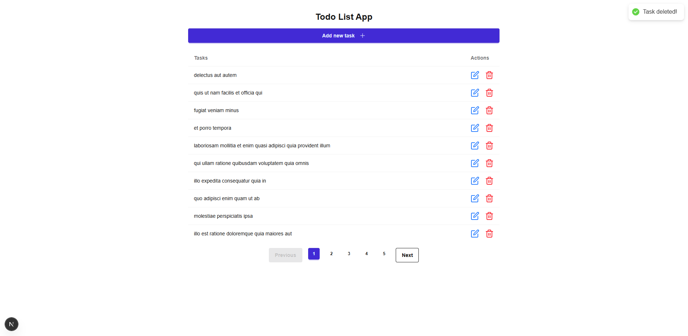
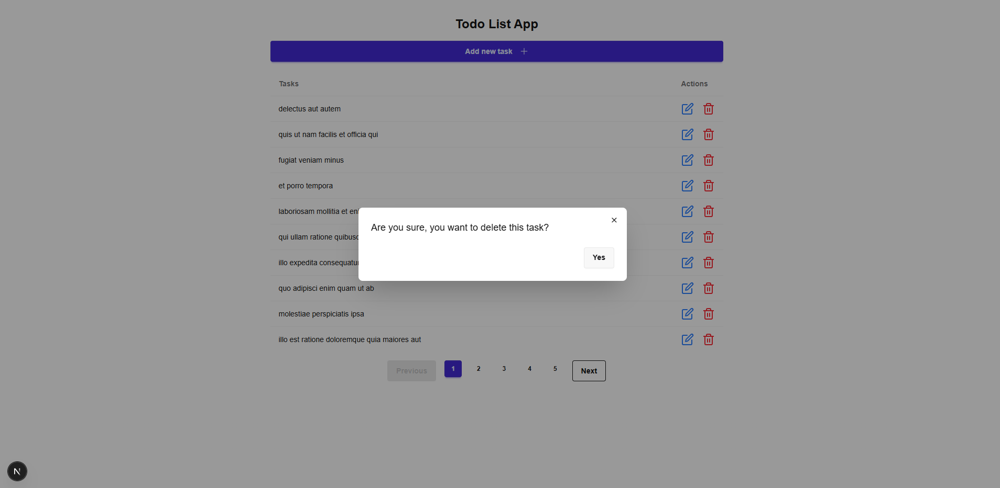
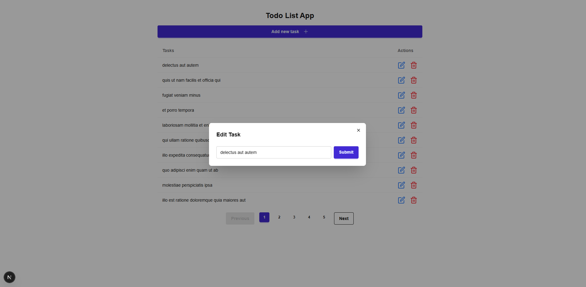
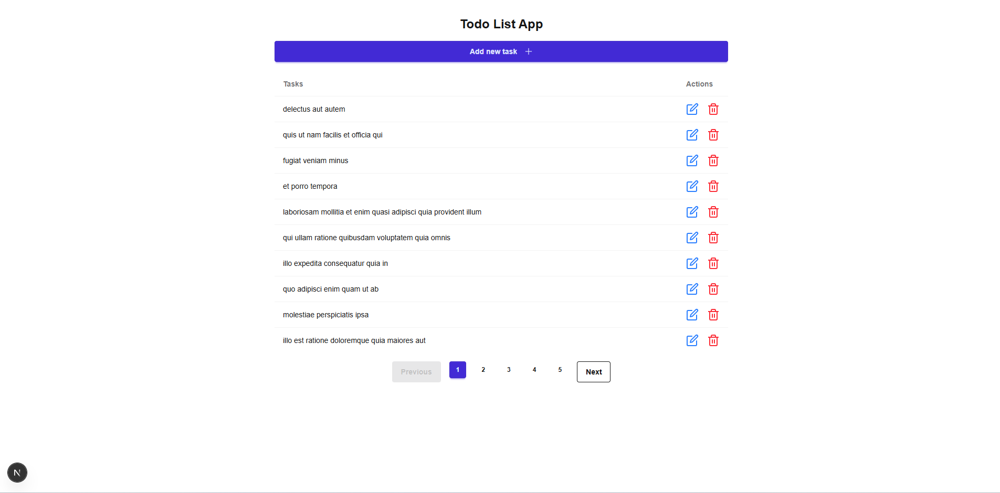

## 📘 README – Todo App (RTK Query + Tailwind + Modal)

This is a simple yet complete Todo App built with **React**, **TypeScript**, **RTK Query**, and **Tailwind CSS**. It uses [`jsonplaceholder.typicode.com`](https://jsonplaceholder.typicode.com/) as the fake REST API.

### ✨ Features

- ✅ Fetch todos with pagination
- ✅ Add a new todo task
- ✅ Edit an existing task (title)
- ✅ Delete a task with confirmation
- ✅ Optimistic UI updates using RTK Query
- ✅ Toast notifications for user feedback
- ✅ Reusable modal component for edit & delete
- ✅ Clean and responsive UI with Tailwind CSS

---

### 📦 Tech Stack

| Tech                | Usage                    |
|---------------------|--------------------------|
| React + TypeScript | Frontend framework       |
| Redux Toolkit       | State & API management  |
| RTK Query           | Data fetching & caching |
| Tailwind CSS        | Styling                 |
| React Hot Toast     | Toast messages          |
| React Icons         | Action icons (Edit/Delete) |

---

### ✅ Submission Checklist

| Task                                  | Done |
|---------------------------------------|------|
| Setup Redux Toolkit + RTK Query       | ✅   |
| Connected API to fetch todos          | ✅   |
| Add new todo item                     | ✅   |
| Edit a todo item                      | ✅   |
| Delete a todo item                    | ✅   |
| Modal for edit and delete             | ✅   |
| Toast notifications on actions        | ✅   |
| Paginated fetch using `_page` & `_limit` | ✅   |
| UI responsiveness with Tailwind       | ✅   |
| Final code cleanup                    | ✅   |
| README ready for submission           | ✅   |

---







### 🚀 How to Run

```bash
# Install dependencies
npm install

# Run the dev server
npm run dev

